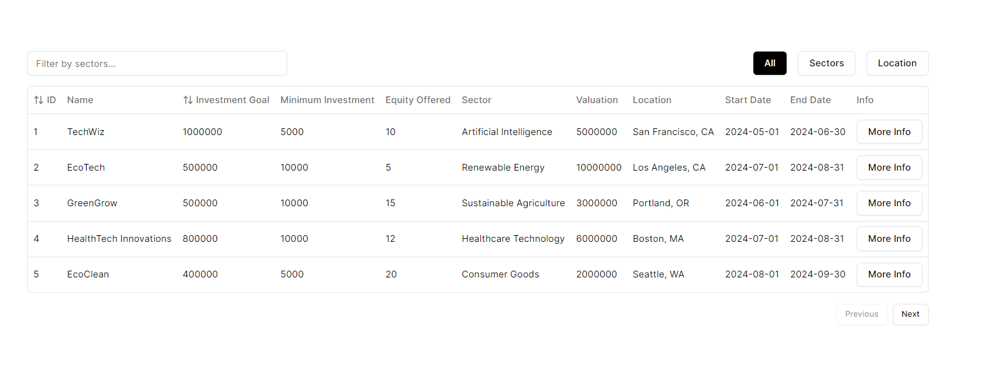
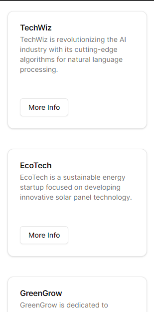
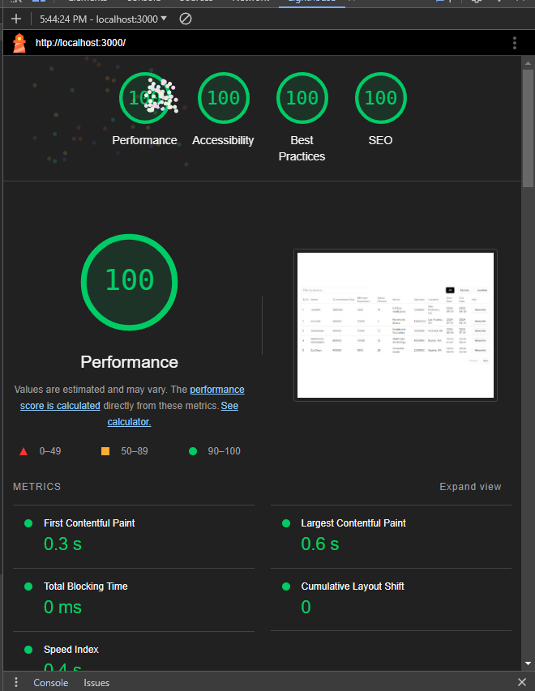
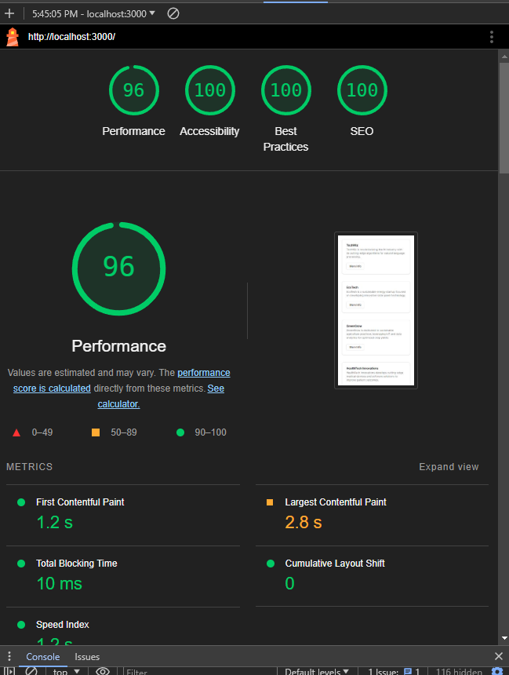

# Palm Outsourcing Technical Interview 

Objective: Develop a simple interactive feature for the equity crowdfunding platform, focusing on user interactions and data presentation. The task will involve creating mock data and displaying it in a user-friendly way.


## Getting Started

First, run the development server:

```bash
cd  palm-outsourcing-technical-interview 
npm install
npm run build
npm run start
```
## What was used in the project

- Next.js
- Radix-ui
- Shadcn
- Axios
- Lucide-react
- tanstack/react-table
- Tailwindcss

## Desktop View


## Mobile View


## Desktop Performance


## Mobile Performance
